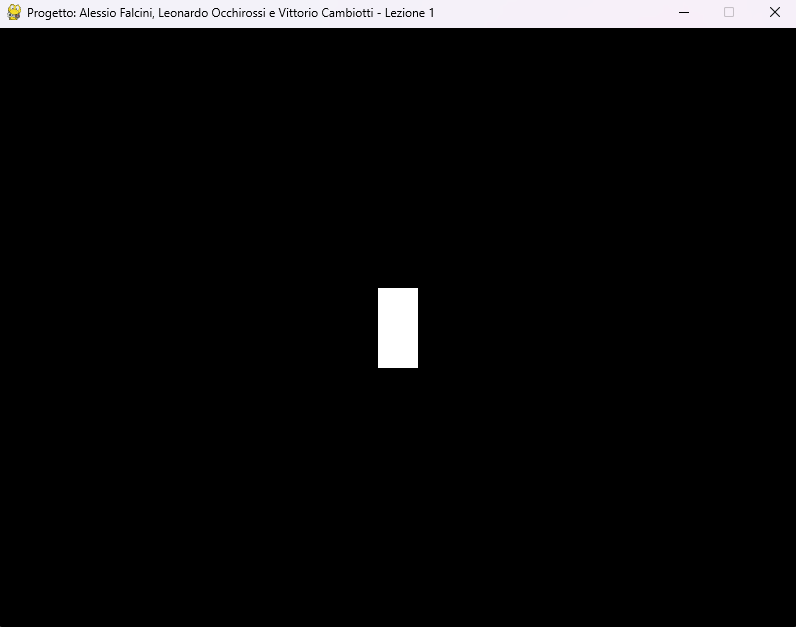

# Lezione 1 — Introduzione e impostazione dell'ambiente di gioco
## Obiettivo della lezione
In questa prima lezione configuriamo l'ambiente di gioco con Pygame, creiamo la finestra principale e posizioniamo il personaggio controllabile (rappresentato da un rettangolo). L'obiettivo è comprendere la struttura minima di un'applicazione Pygame e i suoi componenti fondamentali.
## File in questa lezione
- `lezione_1.py` — codice sorgente eseguibile contenente:
 - inizializzazione di Pygame;
 - creazione della finestra di gioco;
 - definizione dei colori e delle dimensioni;
 - creazione del rettangolo che rappresenta il personaggio;
 - ciclo principale che mantiene la finestra attiva e disegna il personaggio.
## Esecuzione
Per avviare la lezione, eseguire il seguente comando **dalla cartella contenente** `lezione_1.py`:
```bash
python lezione_1.py
```
Si aprirà una finestra di dimensione **800×600** con uno **sfondo nero** e un **rettangolo bianco** posizionato al centro.
---
## Spiegazione passo-passo del codice
### 1. Import e inizializzazione
```python
import pygame
pygame.init()
```
- Importiamo la libreria **Pygame** e la inizializziamo con `pygame.init()`.  
- Questa chiamata è necessaria per preparare i moduli interni di Pygame prima di usarli.
---
### 2. Definizione delle dimensioni della finestra
```python
LARGHEZZA_SCHERMO = 800
ALTEZZA_SCHERMO = 600
```
- Definiamo due costanti per la **larghezza** e l’**altezza** della finestra di gioco.
---
### 3. Creazione della finestra
```python
schermo = pygame.display.set_mode((LARGHEZZA_SCHERMO, ALTEZZA_SCHERMO))
pygame.display.set_caption("...")
```
- `pygame.display.set_mode()` crea la finestra con le dimensioni specificate.  
- `pygame.display.set_caption()` imposta il titolo della finestra.
---
### 4. Definizione dei colori
```python
BIANCO = (255, 255, 255)
NERO = (0, 0, 0)
```
- I colori sono definiti come **tuple RGB** (Red, Green, Blue).
---
### 5. Creazione del personaggio
```python
LARGHEZZA_PERSONAGGIO = 40
ALTEZZA_PERSONAGGIO = 80
personaggio = pygame.Rect(posizione_x, posizione_y, LARGHEZZA_PERSONAGGIO, ALTEZZA_PERSONAGGIO)
```
- Usiamo `pygame.Rect` per rappresentare il personaggio: un **rettangolo** con posizione e dimensioni.  
- Le coordinate iniziali lo posizionano **al centro dello schermo**.
---
### 6. Orologio di gioco
```python
orologio = pygame.time.Clock()
```
- L’oggetto **Clock** permette di controllare il **frame rate** e mantenere il gioco fluido.
---
### 7. Ciclo principale
```python
while gioco_attivo:
   for evento in pygame.event.get():
       if evento.type == pygame.QUIT:
           gioco_attivo = False
   schermo.fill(NERO)
   pygame.draw.rect(schermo, BIANCO, personaggio)
   pygame.display.flip()
   orologio.tick(60)
```
- Il ciclo mantiene attiva la finestra e gestisce gli **eventi** (come la chiusura).  
- `schermo.fill(NERO)` riempie lo sfondo.  
- `pygame.draw.rect()` disegna il rettangolo che rappresenta il personaggio.  
- `pygame.display.flip()` aggiorna lo schermo mostrando i disegni correnti.  
- `orologio.tick(60)` limita il gioco a **60 frame al secondo**.
---
### 8. Terminazione
```python
pygame.quit()
```
- Chiude pulitamente tutti i moduli di Pygame prima di uscire.
---
## Immagini

---
## Note didattiche
- In questa fase **non è ancora implementata la gestione dell’input** (movimento tramite tastiera) o altre logiche (nemici, proiettili).  
 Lo scopo è fornire una **base solida** su cui costruire nelle lezioni successive.  
- Usare `pygame.Rect` è comodo per rappresentare oggetti semplici.  
 Nelle lezioni successive vedremo come usare **immagini (surface)** al posto di rettangoli e come gestire **collisioni più complesse**.
---
**realizzara da Leonardo Occhirossi**
