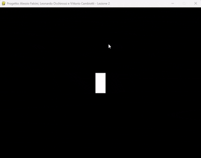

# Lezione 2 — Movimento del personaggio e limiti della finestra

## Obiettivo della lezione

In questa lezione aggiungiamo due funzionalità fondamentali:

- il **movimento del personaggio** tramite i tasti **W, A, S, D**  

- il **vincolo ai bordi della finestra**, in modo che il personaggio non possa uscire dallo schermo.

---

## File in questa lezione

- `lezione_2.py` — codice sorgente eseguibile contenente:

  - gestione dei tasti premuti per muovere il personaggio  

  - controllo dei limiti della finestra  

  - ciclo principale aggiornato per includere il movimento

---

## Esecuzione

Per avviare la lezione, eseguire il seguente comando dalla cartella contenente `lezione_2.py`:

```bash

python lezione_2.py

```

Si aprirà una finestra **800×600** con uno **sfondo nero** e un **rettangolo bianco** che può essere mosso usando i tasti:

- **W** → su  

- **A** → sinistra  

- **S** → giù  

- **D** → destra  

Il personaggio **non potrà uscire dai bordi della finestra**.

---

## Spiegazione delle funzionalità aggiunte

### 1. Movimento del personaggio

```python

tasti = pygame.key.get_pressed()

if tasti[pygame.K_w]: personaggio.y -= velocita_personaggio

if tasti[pygame.K_s]: personaggio.y += velocita_personaggio

if tasti[pygame.K_a]: personaggio.x -= velocita_personaggio

if tasti[pygame.K_d]: personaggio.x += velocita_personaggio

```
### 2. Limiti della finestra

```python

personaggio.x = max(0, min(personaggio.x, LARGHEZZA_SCHERMO - LARGHEZZA_PERSONAGGIO))

personaggio.y = max(0, min(personaggio.y, ALTEZZA_SCHERMO - ALTEZZA_PERSONAGGIO))

```

- Impediamo al personaggio di uscire dai bordi della finestra.  

- `max()` e `min()` limitano le coordinate X e Y alle dimensioni dello schermo

- `pygame.key.get_pressed()` restituisce lo stato di tutti i tasti.  

- Controlliamo i tasti **W, A, S, D** per spostare il rettangolo nelle quattro direzioni.  

- `velocita_personaggio` definisce di quanti pixel si muove il personaggio per frame.
---
## Immagini


---
## Note didattiche

- Abbiamo introdotto l’**input da tastiera** e il **controllo dei bordi** dello schermo.  

- Queste aggiunte rendono il personaggio **interattivo**, preparando la base per la **Lezione 3**, in cui aggiungeremo i **proiettili**

---
**Realizzata da Vittorio Cambiotti**
