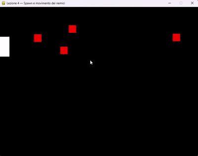

# Lezione 4 — Creazione e Movimento dei Nemici

## Obiettivo della lezione

In questa lezione aggiungiamo **i nemici** che compaiono ai bordi dello schermo e si muovono lentamente verso il giocatore. In questo modo introduciamo una prima **dinamica di pericolo** e rendiamo il gioco più interattivo.

---

## File in questa lezione

- **`lezione_4.py`** — codice eseguibile contenente:
  - Generazione casuale dei nemici ai bordi dello schermo
  - Movimento dei nemici verso il giocatore
  - Mantenimento del sistema di sparo dalla lezione precedente

---

## Esecuzione

Per avviare la lezione, eseguire:

```bash
python lezione_4.py
```

Si aprirà la finestra del gioco.

### Comandi durante l'esecuzione

- **W, A, S, D** — Muoviti in tutte le direzioni
- **Tasto sinistro del mouse** — Spara
- **Nemici rossi** — Compariranno ai bordi e si muoveranno verso di te

---

## Spiegazione delle funzionalità aggiunte

### 1. Generazione casuale dei nemici

```python
def genera_nemico():
    lato = random.choice(['sinistra', 'destra', 'alto', 'basso'])
    # ... calcolo della posizione
    return pygame.Rect(x, y, 30, 30)
```

- I nemici vengono generati in posizioni casuali sui bordi dello schermo
- Scegliere un lato random e poi una coordinata casuale sull'asse perpendiculare
- La funzione restituisce un `pygame.Rect` che rappresenta il nemico come un quadrato di 30×30 pixel

### 2. Movimento verso il giocatore

```python
def muovi_nemico(nemico, giocatore):
    dx = giocatore.centerx - nemico.centerx
    dy = giocatore.centery - nemico.centery
    distanza = math.hypot(dx, dy)
    if distanza != 0:
        dx, dy = dx / distanza, dy / distanza
        nemico.x += dx * velocita_nemico
        nemico.y += dy * velocita_nemico
```

- Calcoliamo il vettore tra il nemico e il giocatore
- Usiamo il **teorema di Pitagora** (`math.hypot`) per calcolare la distanza
- **Normalizziamo** il vettore dividendolo per la distanza (così il movimento è sempre fluido)
- Il nemico si sposta verso il centro del giocatore alla velocità costante

### 3. Spawn temporizzato

```python
tempo_corrente = pygame.time.get_ticks()
if tempo_corrente - ultimo_spawn > tempo_spawn:
    nemici.append(genera_nemico())
    ultimo_spawn = tempo_corrente
```

- Ogni 2 secondi (2000 ms) viene generato un nuovo nemico
- `pygame.time.get_ticks()` misura il tempo trascorso (in millisecondi) dall'inizio del gioco
- Confrontiamo il tempo attuale con l'ultimo spawn per determinare se è passato abbastanza tempo

---

## Concetti chiave

### Calcolo della distanza

La **distanza euclidea** tra due punti si calcola con:

```
distanza = √(dx² + dy²)
```

In Python, `math.hypot(dx, dy)` fa esattamente questo. È molto utile in game development per verificare se due oggetti sono vicini.

### Normalizzazione vettoriale

Dividendo un vettore per la sua lunghezza, otteniamo un **vettore unitario** (di lunghezza 1). Questo permette di:
- Mantenere la stessa velocità indipendentemente dalla distanza
- Muoversi sempre nella stessa direzione, anche se il target è vicino o lontano

### Timing del gioco

Usare `pygame.time.get_ticks()` è fondamentale per:
- Creare spawn temporizzati
- Implementare cooldown per le azioni
- Renderizzare il gioco indipendente dal numero di frame

---
## Immagini


---
## Note didattiche

In questa lezione abbiamo introdotto **oggetti indipendenti dal giocatore**, che reagiscono al suo stato. Ogni nemico sa dove si trova il giocatore e può calcolare automaticamente il percorso verso di lui.

Il **prossimo passo** (Lezione 5) sarà gestire le **collisioni tra proiettili e nemici**, per eliminare i nemici colpiti e aggiungere il vero gameplay.
